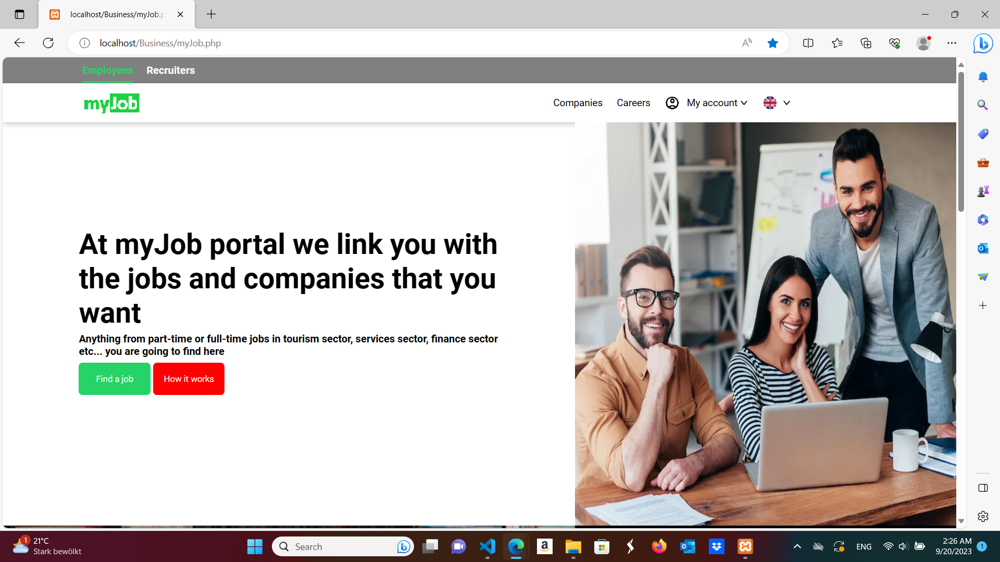
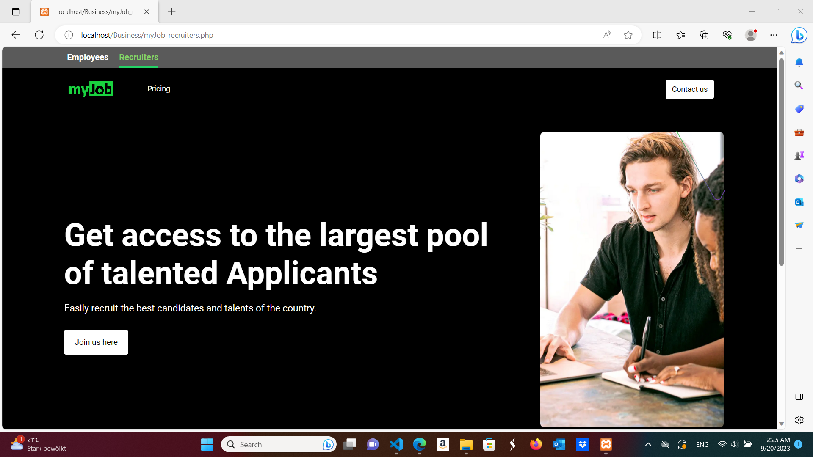
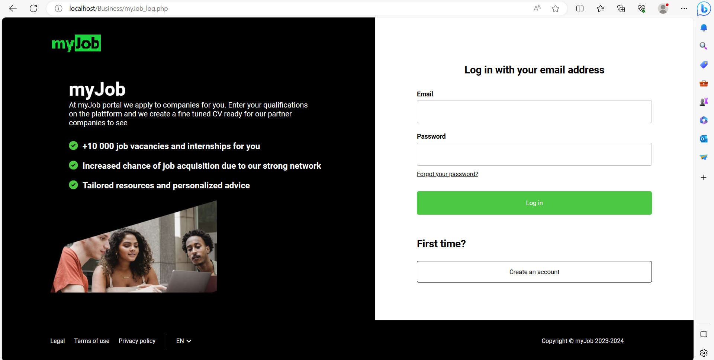
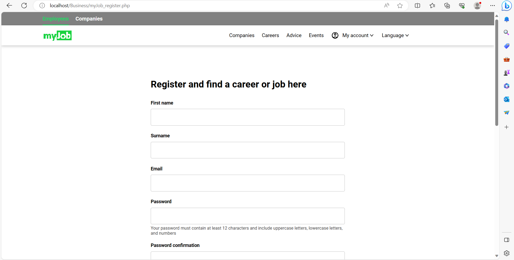
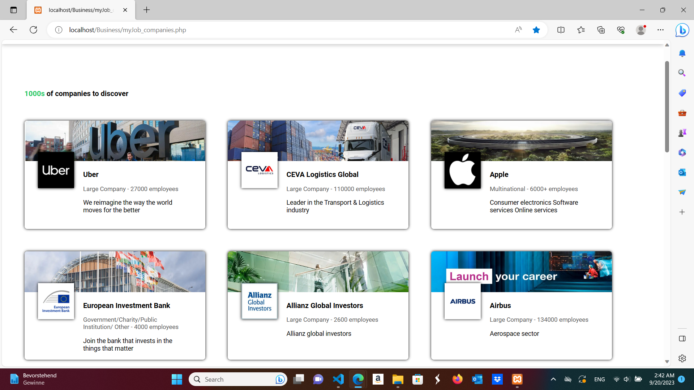

# Employment_app_platform

  
  

MyJob is an employment company that provides recruitement solutions to companies and jobseekers.
How it works:

1. Companies register and post their jobs on the platform.
2. Job seekers register and fill out their qualifications. A pdf version of their resume is automaticaly created (extra service of myJob).
3. Job seekers choose the industry they are interested in and their resume is automatically sent to the partnered companies of that industry.
4. Companies choose which applicants to accept for an interview.
5. Accepted applicants are notified and choose to accept or reject the offer.

